# 📊 SEC Analyzer Bot

<div align="center">

**A Telegram bot that monitors SEC filings and insider trading for a configurable watchlist.**

Triggered by natural language commands — no cron, no server, no cloud required.  
Runs on Android (Termux) or any Linux machine.

[](https://python.org)
[](https://openrouter.ai)
[](https://telegram.org)
[](LICENSE)

</div>

---

## ✨ Features

| | |
|---|---|
| 📄 **13 Form Types** | 10-K, 10-Q, 8-K, Form 4, SC 13G/D, S-1, DEF 14A, and more |
| 🔐 **Insider Trading** | Form 4 analysis with sentiment signal (Bullish / Bearish / Neutral) |
| 🧠 **Smart Caching** | Never re-analyzes a filing already processed |
| 🤖 **Guided Setup** | First-run wizard — no config file editing needed |
| ⚙️ **Full Telegram Control** | Manage tickers, forms, model, and all settings via chat commands |
| ⚡ **OpenRouter Free LLM** | Llama 3.3 70B by default — 128K context, $0 cost |
| 📱 **Lightweight** | Runs on a mid-range Android phone via Termux |

---

## 🔄 How It Works

```mermaid
graph TD
    A["You send 'Any news?' on Telegram"] --> B["Bot fetches latest filings via edgartools (SEC EDGAR)"]
    B --> C["New filings extracted, key sections isolated"]
    C --> D["OpenRouter LLM analyzes with form-specific prompts"]
    D --> E["Structured report sent back via Telegram"]
    E --> F["Filing cached — won't be processed again"]
    
    style A fill:#005266
    style F fill:#360066
```



---

## 💬 Commands

### Scans
| Command | Action |
|---|---|
| `Any news?` · `Check` · `/sec` | Scan full watchlist with default forms |
| `Insider` · `/insider` | Form 4 only across watchlist |
| `Check all` · `/all` | SEC + Insider combined |
| `/scanticker AAPL` | Scan single ticker, default forms, no watchlist add |
| `/scanticker AAPL 10-K 4` | Scan single ticker with specific forms |

### Ticker Management
| Command | Action |
|---|---|
| `/addticker AAPL` | Add ticker to watchlist |
| `/addticker AAPL MSFT NVDA` | Bulk add |
| `/removeticker AAPL` | Remove ticker |
| `/listtickers` | Show full watchlist |

### Form Management
| Command | Action |
|---|---|
| `/listforms` | All 13 supported forms + which are active |
| `/addform SC 13G` | Add form to default scan |
| `/removeform 8-K` | Remove form from default scan |

### Settings
| Command | Action |
|---|---|
| `/settings` | Show all current settings |
| `/setmodel <model>` | Switch LLM model |
| `/setlookback 60` | Set lookback window in days |
| `/setchars 15000` | Set max characters per section |

---

## 📋 Supported Form Types

| Form | Description |
|---|---|
| `10-K` | Annual report |
| `10-Q` | Quarterly report |
| `8-K` | Current events / material events |
| `4` | Insider buy/sell transactions |
| `144` | Restricted stock sale notice |
| `SC 13G` | Passive major shareholder (>5%) |
| `SC 13D` | Active / activist major shareholder |
| `S-1` | IPO registration statement |
| `424B4` | Prospectus |
| `20-F` | Foreign company annual report |
| `6-K` | Foreign company current report |
| `DEF 14A` | Proxy / shareholder vote statement |
| `11-K` | Employee retirement plan report |

Each form type has its own tailored analysis prompt — SC 13G triggers ownership analysis, S-1 triggers IPO attractiveness scoring, DEF 14A triggers proxy vote analysis, and so on.

---

## 🚀 Quick Start

```bash
git clone https://github.com/authorturker/sec-analyzer-ai.git
cd sec-analyzer-ai
python -m venv venv
source venv/bin/activate
pip install edgartools requests tzdata
nano config.py
python bot.py
```

The first run launches an interactive setup wizard — no manual JSON editing.

---

## ⚙️ Configuration

`config.py` now contains only four fields:

```python
EDGAR_IDENTITY     = "Your Name yourname@email.com"  # Required by SEC
OPENROUTER_API_KEY = "sk-or-v1-..."                  # From openrouter.ai
TELEGRAM_BOT_TOKEN = "123456:ABC..."                 # From @BotFather
TELEGRAM_CHAT_ID   = "123456789"                     # From @userinfobot
```

Everything else — tickers, default forms, model, lookback window — is managed live via Telegram commands and stored in `bot_config.json`.

### Free LLM Models

```python
/setmodel meta-llama/llama-3.3-70b-instruct:free
/setmodel google/gemma-3-27b-it:free
/setmodel deepseek/deepseek-chat-v3-0324:free
```

Free tier resets daily at UTC 00:00. A full scan of 8 tickers generates ~25–40 calls — well within the 50 requests/day limit.

---

## 📱 Running on Android (Termux)

Install [Termux from F-Droid](https://f-droid.org/packages/com.termux/) — not the Play Store — then:

```bash
pkg update -y && pkg upgrade -y
pkg install -y python python-pip tmux
pip install edgartools requests tzdata
```

Run in background with tmux:

```bash
tmux new -s sec
python bot.py
# Ctrl+B then D to detach
```

---

## 🗂 Project Structure

```text
sec-analyzer-ai/
├── bot.py              # Main bot — polling, SEC & insider scan logic
├── config.py           # Secrets only — not committed to git
└── reports/            # Auto-created at runtime
    ├── bot.log
    ├── bot_config.json  # Runtime settings (managed via Telegram)
    └── cache.json       # Analyzed filings cache
```

---

## 📊 Analysis Output Example

```text
🏢 MU — 10-Q
📅 2026-04-03

📊 Quarter Performance
- Revenue: $8.7B (+18% YoY) — strong DRAM demand
- Gross margin: 34.2% → 38.1% (HBM contribution)

🔑 Key Messages from Management
- AI server demand tracking above expectations
- HBM3E capacity expansion on track for Q3

⚠️ Notable Changes
- NAND pricing pressure continues
- China export restrictions remain an overhang

👀 3 Factors to Watch
1. HBM ramp cadence and yield rates
2. PC/mobile DRAM pricing recovery
3. Further export control developments
```

---

## 💰 Cost

**$0.** OpenRouter free tier — 50 requests/day per model, resets UTC 00:00.  
Loading $10 credit raises the limit to 1,000/day (only drawn on paid models).

---

## 🔧 Troubleshooting

| Error | Fix |
|---|---|
| `403 Forbidden` from SEC | `EDGAR_IDENTITY` must be `"Name email@domain.com"` |
| `No time zone found with key UTC` | Run `pip install tzdata` |
| `429 Too Many Requests` | Rate limit — bot retries; switch model with `/setmodel` |
| `⚠️ Analysis unavailable` | API timeout — retry or switch model |

---

## 📝 Release Notes

### v2.0.0
- First-run wizard — interactive setup on first launch, no config file editing.
- 13 supported form types — SC 13G/D, S-1, 424B4, DEF 14A, 20-F, 6-K, 11-K, 144 added.
- Form-specific prompts — each form type now has a tailored analysis prompt.
- Full Telegram settings management — `/setmodel`, `/setlookback`, `/setchars`.
- Form management via Telegram — `/addform`, `/removeform`, `/listforms`.
- Bulk ticker operations — `/addticker AAPL MSFT NVDA` in one command.
- Enhanced `/scanticker` — now accepts specific forms: `/scanticker AAPL 10-K SC 13G`.
- `config.py` reduced to 4 fields — all runtime settings moved to `bot_config.json`.

### v1.1.0
- Switched LLM backend from Gemini to OpenRouter free tier.
- Added insider trading scan (Form 4).
- Added smart caching — no duplicate analyses.
- Added `/scanticker` for on-demand scans without watchlist modification.

### v1.0.0
- Initial release.
- SEC filing monitoring (10-K, 10-Q, 8-K).
- Telegram command interface.
- Runs on Android via Termux.

---

## 📚 Support the Project

If you want to support this work, you can buy me a coffee.

 : 178hyCd89p2QQnyUCL5y6hpzyJqu7QHz34

 : 0xf886b701d0abC89c2f59a8F98d1edF739D4b39a2

 : MXpoKvp1ZojjZ1fXYhgLCYfUo3R9U43jiCF8cEA1q1Y

---

## ⚠️ Disclaimer

This tool is for informational purposes only. Nothing it produces constitutes investment advice. Always do your own research before making investment decisions.

---

## 📄 License

MIT
